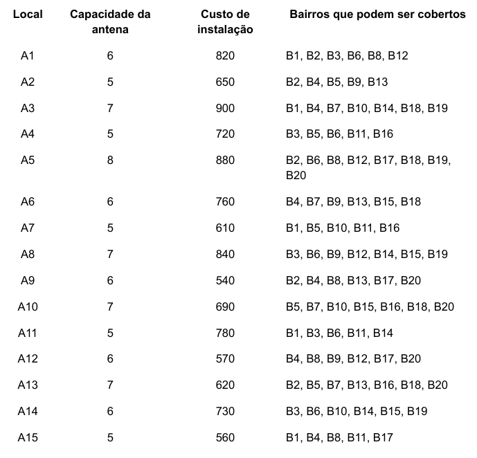
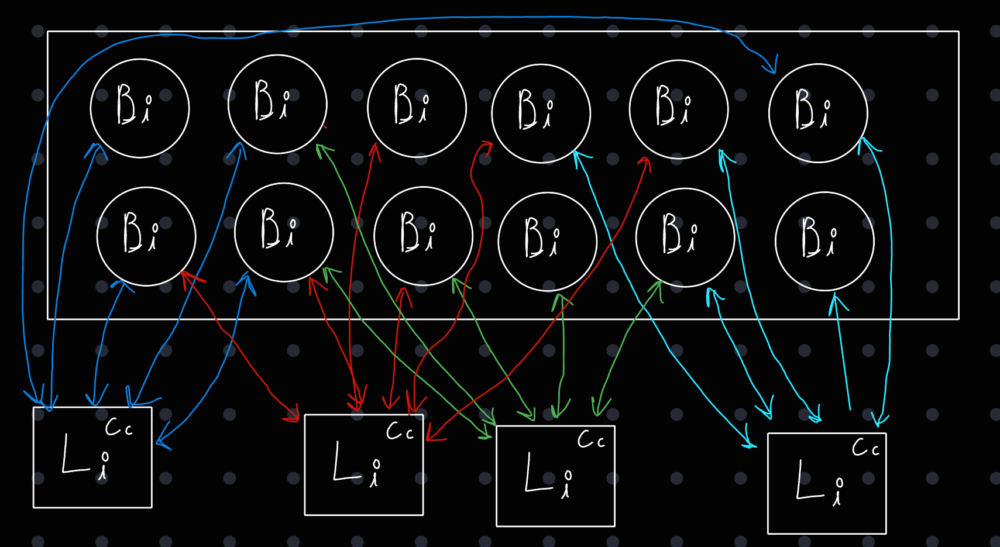

# Descrição
## Problema
O problema trata sobre um cenário onde existem diversos bairros que precisam receber cobertura de sinal, e antenas podem ser instaladas em locais que podem fornecer sinal para eles mas existem variáveis nessa situação:
  - Cada Local pode receber uma antena com uma certa capacidade e custo, que vai disponibilizar cobertura de sinal para certos bairros 
  - Se um Bairro já recebe cobertura de uma antena, não pode receber de outra (sem regiões sobrepostas)
  - **Todos** os bairros devem receber cobertura para que a região seja aceita

> O objetivo principal é otimizar o custo do processo (instalação das antenas) consiguindo alcançar a cobertura completa



## Solução
### Representação
A solução deve ser representada na forma:
```
S={A_a,A_b,A_c,...A_n}

f(S) = c(A_a)+ c(A_b)+ c(A_c)+ ...+ c(A_n)
```
### Algoritmos
Deve ser implementado um algoritmo que combine algoritmos construtivo e de busca local que proponha uma solução viável para o problema.
- Parte Construtiva
  - Define uma heurística ideal para avaliar as soluções
  - Define uma solução inicial
- Parte da Busca Local
  - A partir de uma solução inicial, tenta encontrar soluções melhores

## Algoritmo Implementado

### Heurísticas
- Fator de Cobertura/Custo (Cc)
  - Quanto maior melhor
  - O fator não leva em conta os nós que já possuem cobertura
    - A cada passo, os vizinhos do nó adicionado precisam ter seu Cc recalculado

## Elementos:
  ### Local:
  - Entidade que aponta para Bairros
  - Possui um identificador de cobertura, custo e custo-benefício
  - O identificador de cobertura, e de custo-benefício são atualizados se uma das conexões for coberta
  - Quando selecionado, marca todos os bairros descobertos para o qual aponta como cobertos

  ### Bairro:
  - Entidade que carrega a informação de se está coberto ou não
  - Sabe quem são todos os locais que apontam para ele
  #### GRAFO ESPARSO:
  - Quando marcado como coberto, diminui o contador de cobertura de todos os locais que apontam para ele
  #### GRAFO DENSO:
  - Quando marcado como coberto, diminui o contador de cobertura de todos os locais que apontam para ele e se remove da lista bairros apontados pelo local

  
## Pseudocódigo
1. Percorre todas os locais em O(n) e verifica o fator Cc de cada um, o melhor fator é dado como solução inicial
2. A cada passo, sempre adiciona o nó com o maior Cc, sempre atualizando o Cc dos vizinhos a cada passo
3. Algoritmo termina quando há cobertura completa
